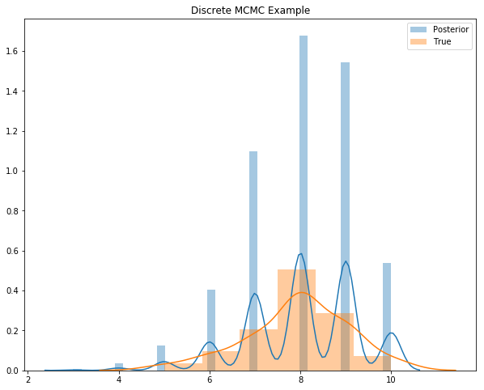

## Discrete variable Reversible jump MCMC sampler

This tiny utility package implements the reversible jump MCMC algorithm proposed by Green (1995).

### Algorithm

1. Draw a uniform random variable `u`

2. if `u` < 0.5 then take the *birth-death* step: random select a position
in `initial_array`, if it is 0 then turn it to 1 and turn it into 0 vice
versa.

3. if `u` > 0.5 then take the *swap* step, randomly select one location     with 1 and exchange it to 0. If current state is full or null model, do not do
any swap. Instead directly go to the next iteration.

4. calculate posterior from before and after, calculate the bayes factor between two models. Generate another uniform random variable `u2` and accept the proposal if `u2` < bayes factor.

### Usage

```python
import numpy as np
from scipy.stats import bernoulli
import matplotlib.pyplot as plt
import seaborn as sns
from dmcmc import MCMCMC

# Define a binomial likelihood function
# Assuming uniform prior
def logbinomial(x, omega):
    '''
    x is a numpy.ndarray object. Shape is (n,1)
    omega is the probabilty or event ( or p in the binomial distribution)
    '''
    numOnes = np.sum(x)
    total = x.shape[0]
    return np.log(omega**numOnes * (1 - omega)**(total - numOnes))


true_p = 0.8
initial_p = 0.1
dims = 10

initial_array = bernoulli.rvs(initial_p, size=dims)

results, _ = MCMCMC(initial_array, logbinomial, [true_p], niter=10000)

fig,ax = plt.subplots(figsize=(10,8))
sns.distplot(np.sum(results, axis=1), label='Posterior')
sns.distplot(np.sum(bernoulli.rvs(true_p, size=(100,dims)), axis=1), label='True')
plt.legend()
plt.title('Discrete MCMC Example')
```

The above code results in a posterior distribution as expected:



### Contribution

Pull Requests are welcome!

### Reference

[Reversible jump Markov chain Monte Carlo computation and Bayesian model determination, P.J Green, Biometrika (1995), 82, 4, pp. 711-32](https://pdfs.semanticscholar.org/c440/ea3bbb7fc8dcaa069ea550011ea65ac33fd4.pdf)